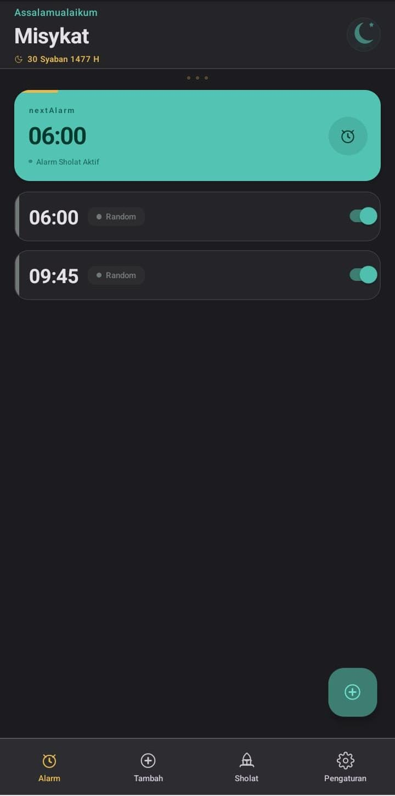
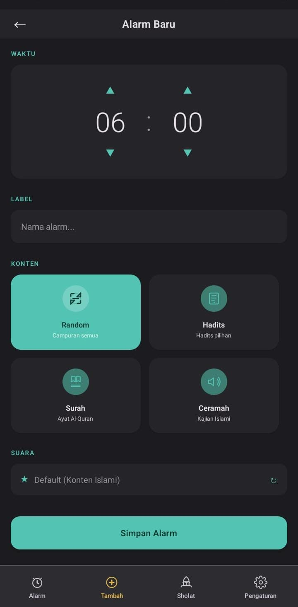
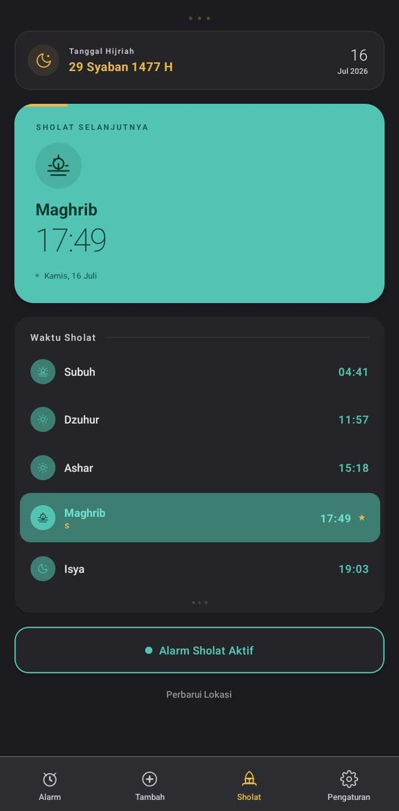
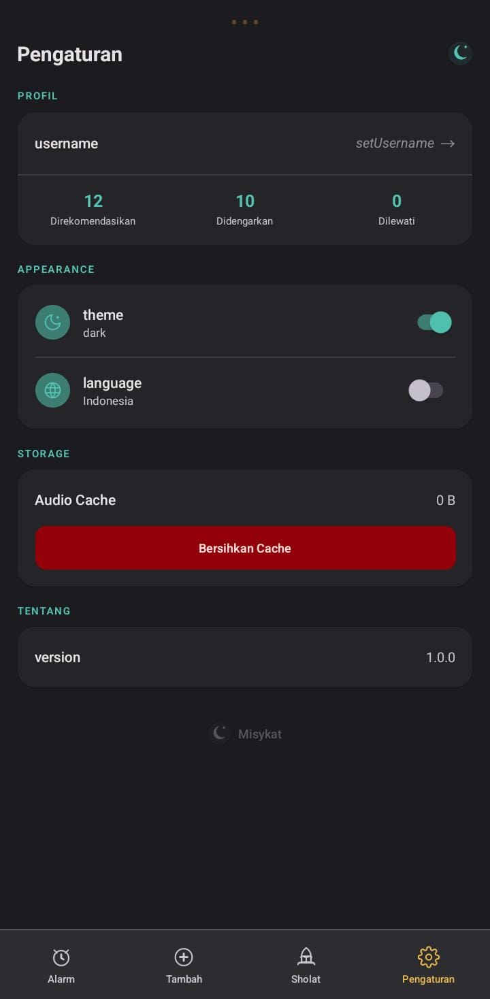

<div align="center">
  
  <h1 align="center">Misykat</h1>
  <h3 align="center">مشكاة</h3>
  <p align="center">Aplikasi alarm Islami dengan auto-open di lock screen, streaming audio, adhan, dan jadwal sholat</p>
  <p align="center">
    <a href="https://github.com/ha-neko/Misykat/releases/tag/nightly">
      
    </a>
    <a href="https://github.com/ha-neko/Misykat/actions/workflows/build-apk.yml">
      
    </a>
    <a href="https://github.com/ha-neko/Misykat/blob/main/LICENSE">
      
    </a>
    
    
  </p>
  <p align="center">
    <a href="#-download">Download</a>
    ·
    <a href="#-features">Features</a>
    ·
    <a href="#-screenshots">Screenshots</a>
    ·
    <a href="#-build">Build</a>
  </p>
</div>

---

> **Misykat** (مشكاة) — dari QS An-Nur 24:35, artinya *relung* tempat lampu diletakkan. Sebuah metafora cahaya Islam dalam kehidupan.

---

## 📥 Download

| Package | Link |
|---------|------|
| **Universal APK** (all devices) | [⬇️ Download Nightly](https://github.com/ha-neko/Misykat/releases/download/nightly/app-universal-release.apk) |
| arm64-v8a APK | [⬇️ Download](https://github.com/ha-neko/Misykat/releases/download/nightly/app-arm64-v8a-release.apk) |
| armeabi-v7a APK | [⬇️ Download](https://github.com/ha-neko/Misykat/releases/download/nightly/app-armeabi-v7a-release.apk) |
| x86_64 APK | [⬇️ Download](https://github.com/ha-neko/Misykat/releases/download/nightly/app-x86_64-release.apk) |

> Semua build otomatis oleh GitHub Actions setiap push ke `main`. Tidak perlu login — langsung download.

---

## ✨ Features

| | Feature | Detail |
|---|---------|--------|
| 🔔 | **Alarm lock screen** | Auto-open seperti WhatsApp call — langsung muncul meskipun HP terkunci atau sedang di app lain |
| 🎵 | **Custom sound / MP3** | Pilih audio favorit sebagai nada alarm dari file manager |
| 📖 | **Streaming Quran & Kajian** | Quran dari EveryDay Quran CDN, kajian Rodja, adhan otomatis |
| 🕌 | **Waktu sholat** | Berdasarkan lokasi pengguna via `expo-location` + library `adhan` + kalender Hijriyah |
| 💡 | **Motivasi Islami** | Ayat Al-Qur'an + hadits + kata bijak, 4 kategori bertema, wallpaper sesuai kategori, infinite scroll |
| 🤖 | **Rekomendasi konten** | Sistem rekomendasi lokal berdasarkan preferensi pengguna |
| 🌙 | **Tema gelap/terang** | Material 3, Auto-save di AsyncStorage |
| 🌐 | **Dua bahasa** | Indonesia (default) dan Inggris |
| 🎨 | **Material 3 Islamic** | Gold accents, gradient cards, decorative elements — tanpa emoji, semua SVG |

---

## 🏗️ Arsitektur

```
JavaScript (React Native)
├── Screens: Home, AddAlarm, AlarmRinging, PrayerTimes, Motivation, Settings, Permission
├── Utils: nativeAlarm, notifications, audio, cache, recommendation, hijri, motivations
├── Components: HoldArrow, TimePicker, TabIcons, Icons
└── Theme: Material 3 dark/light + LanguageContext (ID/EN)

Native (Android) — via Expo Modules API
├── MisykatAlarmModule.kt      — schedule/cancel/getInitialAlarmData
├── MisykatAlarmService.java    — Foreground service (WhatsApp-call behavior)
├── AlarmReceiver.java          — Terima broadcast → start foreground service
└── MainActivity (patched)      — showWhenLocked, onNewIntent
```

### Sumber Konten Motivasi

| Sumber | API | Penggunaan |
|--------|-----|------------|
| Al-Qur'an | `api.alquran.cloud` | Search per kata kunci kategori + ayat acak |
| Hadits | `hadis-api-id.vercel.app` | 9 perawi (Bukhari, Muslim, dsb.) — pelengkap setelah pool tematik habis |
| Kata bijak | `zenquotes.io` | Khusus kategori *umum* |

- 4 kategori: **Pekerjaan, Keluarga, Umum, Ibadah** — ayat dicari per kata kunci (`bekerja, rezeki, usaha, …`)
- Pool tematik per kategori di-paginate, sehingga konten tetap relevan dan infinite scroll tidak pernah berhenti
- Quote dibatasi ±260 karakter, diurutkan pendek-dahulu
- Wallpaper mengikuti tema kategori (LoremFlickr per kata kunci, fallback picsum)
- Download menghasilkan gambar quote ala Pinterest (1080×1620) via export `react-native-svg` → galeri (`saveToLibraryAsync`)

### Alur Alarm
```
1. JS scheduleAlarm() → AlarmManager.setExactAndAllowWhileIdle()
2. Waktu tiba → Broadcast com.misykat.ALARM
3. AlarmReceiver → startForegroundService(MisykatAlarmService)
4. MisykatAlarmService → WakeLock + CATEGORY_CALL notification
                       → PendingIntent.send() → MainActivity
5. MainActivity onNewIntent → JS deteksi via getInitialAlarmData()
6. AlarmRingingScreen — play audio/custom sound, dismiss
```

---

## 📱 Screenshots

| Home | Set Alarm |
|:---:|:---:|
|  |  |

| Prayer Times | Motivation | Settings |
|:---:|:---:|:---:|
|  |  |  |

---

## 🔧 Build

### Via GitHub Actions (recommended)
```bash
git push origin main
```
Build otomatis, hasilnya langsung bisa download di [Releases](https://github.com/ha-neko/Misykat/releases/latest).

### Via Local
```bash
npm ci
npx expo prebuild --clean
cd android
./gradlew assembleDebug    # APK debug
./gradlew assembleRelease  # APK release
```

### Via EAS Build
```bash
npx eas build --platform android --profile preview
```

---

## 📱 Izin

| Izin | Untuk |
|------|-------|
| `POST_NOTIFICATIONS` | Notifikasi alarm (Android 13+) |
| `SCHEDULE_EXACT_ALARM` | AlarmManager.setExactAndAllowWhileIdle() |
| `USE_FULL_SCREEN_INTENT` | Tampil full-screen di lock screen |
| `FOREGROUND_SERVICE` | Foreground service untuk alarm seperti WhatsApp call |
| `WAKE_LOCK` | Wake lock agar CPU tetap aktif saat alarm |
| `RECEIVE_BOOT_COMPLETED` | Reschedule alarm setelah reboot |
| `ACCESS_FINE_LOCATION` | Lokasi untuk waktu sholat |
| `READ_MEDIA_IMAGES` / `WRITE_EXTERNAL_STORAGE` | Menyimpan gambar quote motivasi ke galeri |

Semua izin diminta saat pertama kali di `PermissionScreen`.

---

## 🧪 Debug

```bash
# Cek native module
adb logcat -s MisykatAlarmModule MisykatAlarmSvc MisykatAlarm ReactNative

# Cek autolinking
npx expo-modules-autolinking resolve --platform android --json

# Cek APK
unzip -l app-debug.apk | grep Misykat
aapt d xmltree app-debug.apk AndroidManifest.xml | grep -A5 AlarmReceiver
```

---

## 📄 License

MIT © ha-neko
